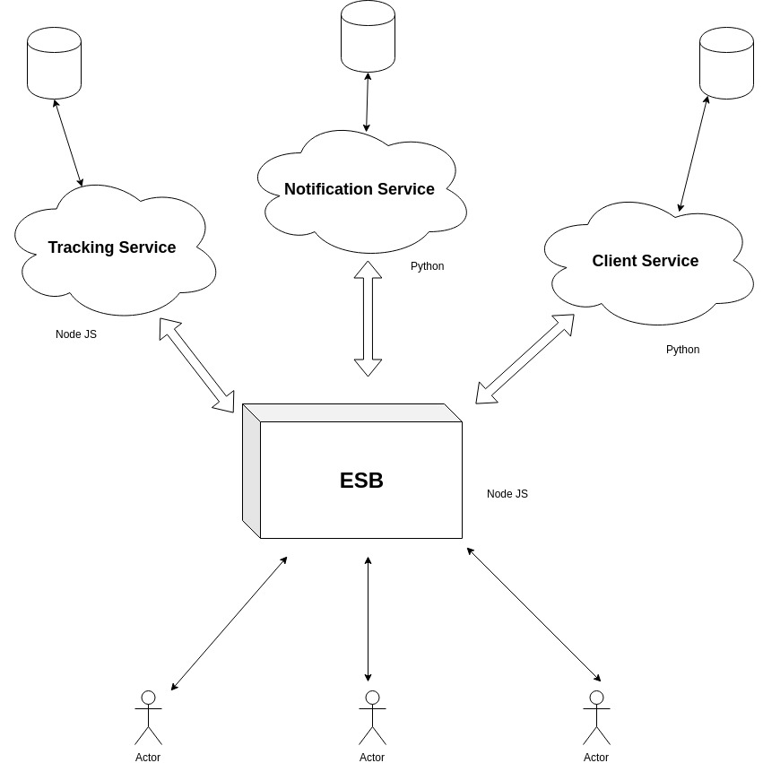

# TAREA 2: Software Avanzado

Universidad de San Carlos de Guatemala


## Datos de Estudiante
* Nombre Ricardo Antonio Cutz Hernandez
* Carne: 201503476

# Running Demo

## Requirenments
* Docker
* Terminal to run sh scripts

## How to run Demo
1. In this directory ther are two sh scripts:
```bash
$ ls 
run.sh      stop.sh
$ sh run.sh
```
2. All the environment will start running, to check it run the folling command to check all the containers:
```
$ docker ps -a
```
3. Now you can use Postman to make petitions to the ESB
4. Check the ESB Documentation by reading README.md file to learn how to call the ESB.
5. If you want to stop running this demo just run:
```bash
$ sh stop.sh
```
# Solution's diagram
The ESB is in charge of calling the 3 services and returning responses to the client, the following diagram explains how does it works:



Each service directly communicates with the ESB and so the ESB with each of the services, clients only can communicate with the ESB.

